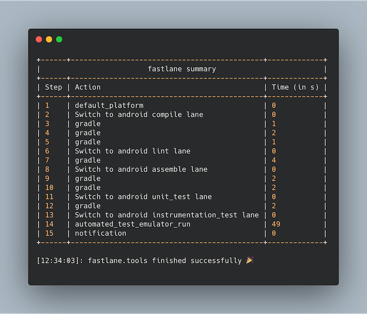

# Android Fastlane

A Fastlane template to execute an Android CI pipeline locally using Fastlane.



This repository has been inspired by the [Automate Your Development With Fastlane](https://medium.com/better-programming/automate-your-development-with-fastlane-247221e6c0c5) blog post on Medium. In order to achieve a faster feedback loop, developers can utilize Fastlane to test out their development prior to making a merge request.

</br>

## Motivation

Why should developers care for this? Fastlane is a great tool for automating any tedious tasks in building, testing and deploying mobile applications. For most software applications, having a continuous integration (CI) strategy is essential. It helps validate the changes prior to merging it into the mainline branch. In addition to having a CI server such as GitLab CI/CD, Travis CI or Jenkins, developers can have the freedom to run some or all parts of the pipeline locally on their development machines to validate their work prior to making a merge request. This will result in a faster feedback loop as well as the flexibility to debug issues easier and faster.

</br>

## Getting Started

#### Install fastlane 
```
# Using RubyGems
sudo gem install fastlane -NV

# Alternatively using Homebrew
brew cask install fastlane
```
For more information, refer to the [fastlane docs](https://docs.fastlane.tools/getting-started/ios/setup/).

</br>

#### Initialize fastlane in the project's directory
```
fastlane init
```

This will create a fastlane folder.

</br>

#### Replace Fastfile with the Fastlane and Pluginfile in this repository

The template in this repository already has the desired lanes.

</br>

## Usage

The Fastfile contains six lanes that can be executed independently. In order to run the full CI pipeline, developers can execute the following command:
```
fastlane pipeline
```
This will execute the required lanes as well as produce a fastlane summary as shown in the picture above. To run a single lane, developers can execute:
```
fastlane <lane>
```

</br>

## Fastfile

| Lanes         | Description   |
| ----------- | ------------- |
| config     | Outputs configuration for debugging   |
| compile      | Compile debug sources   |
| lint | Performs Android lint   |
| assemble | Assemble source and test APK   |
| unit_test | Executes unit tests   |
| instrumentation_test | Executes instrumentation tests using an Emulator   |
| pipeline | Executes compile, lint, assemble, unit_test and instrumentation_test lanes   |